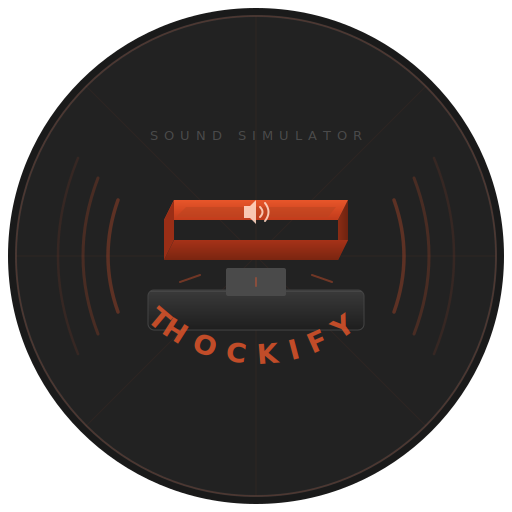

> [!NOTE]
> This project was moved to a better supported GUI version, check it out - [Thokify](https://github.com/AlbertArakelyan/Thockify)

<p align="center">
  
</p>

<h1 align="center">Thockify</h1>

<p align="center">
  Turn any keyboard into a mechanical keyboard — real-time sound simulator written in Rust.
</p>

<p align="center">
  Thockify runs silently in the background, listening for every key press and release across your entire system, and plays authentic mechanical keyboard sounds with zero perceptible latency. Swap between sound profiles to find your perfect <i>thock</i>.
</p>

---

## Installation

### Prerequisites

- [Rust toolchain](https://rustup.rs/) (1.85+ recommended, edition 2024)
- An audio output device
- Windows 10/11 (macOS and Linux support planned)

### From source

```bash
git clone https://github.com/your-username/thockify-cli.git
cd thockify-cli
cargo install --path .
```

This installs the `thok` binary to `~/.cargo/bin/`. Make sure that directory is in your `PATH`.

### Development build

```bash
cargo build              # debug build
cargo build --release    # optimized build
```

During development, use `cargo run --` in place of `thok`:

```bash
cargo run -- start
cargo run -- --profile topre
```

---

## Usage

Every command exits immediately after completing its action. The sound engine runs as a separate background process.

### Set a profile

```bash
thok --profile topre
```

Saves the selected sound pack to your settings. The profile name corresponds to a folder inside `sound-packs/`.

### Start the sound engine

```bash
thok start
```

Launches the sound engine in the background. You can close your terminal — it keeps running. Requires a profile to be set first.

### Stop the sound engine

```bash
thok stop
```

Stops the background sound engine.

### List available profiles

```bash
thok profile list
```

Lists all sound pack folders found in the `sound-packs/` directory.

### Typical workflow

```bash
thok profile list          # see what's available
thok --profile topre       # select a sound pack
thok start                 # start listening
# ... type anywhere and hear the sounds ...
thok stop                  # done
```

You can also set the profile and start in one command:

```bash
thok --profile topre start
```

---

## Sound Packs

Sound packs live in the `sound-packs/` directory. Each pack is a folder containing WAV files:

```
sound-packs/
  topre/
    fallback.wav          # default key press
    fallback-up.wav       # default key release
    enter.wav             # enter press
    enter-up.wav          # enter release
    spacebar.wav          # spacebar press
    spacebar-up.wav       # spacebar release
    backspace.wav         # backspace press
    backspace-up.wav      # backspace release
```

At minimum, a sound pack needs `fallback.wav` and `fallback-up.wav`. All other key-specific files are optional — unmapped keys fall back to the defaults.

To add a new sound pack, create a folder in `sound-packs/` with your WAV files and select it with `thok --profile <folder-name>`.

---

## How It Works

Thockify hooks into your operating system's keyboard events globally using `rdev`. When a key is pressed or released, it plays the corresponding WAV file through `rodio`'s audio mixer.

Key design decisions:

- **Pre-loaded audio** — All WAV files are read into memory at startup. No disk I/O during playback.
- **Concurrent playback** — Uses `play_raw()` instead of `Sink` to play sounds immediately and concurrently. Fast typing never causes queuing or lag.
- **Background daemon** — The `start` command spawns a detached process and exits. A PID file tracks the running instance so `stop` can clean it up.
- **Key deduplication** — OS key-repeat events are filtered out so held keys don't produce a stream of sounds.

---

## Configuration

Settings are stored at:

| Platform | Path |
|----------|------|
| Windows  | `%APPDATA%\thockify\settings.json` |
| macOS    | `~/Library/Application Support/thockify/settings.json` |
| Linux    | `~/.config/thockify/settings.json` |

The PID file for the running daemon is stored in the same directory as `thok.pid`.

---

## Dependencies

| Crate | Purpose |
|-------|---------|
| [clap](https://crates.io/crates/clap) | Command-line argument parsing |
| [rdev](https://crates.io/crates/rdev) | Global keyboard event listener |
| [rodio](https://crates.io/crates/rodio) | Audio decoding and playback |
| [serde](https://crates.io/crates/serde) + [serde_json](https://crates.io/crates/serde_json) | Settings serialization |
| [dirs](https://crates.io/crates/dirs) | Cross-platform config directory resolution |

---

## License

MIT
